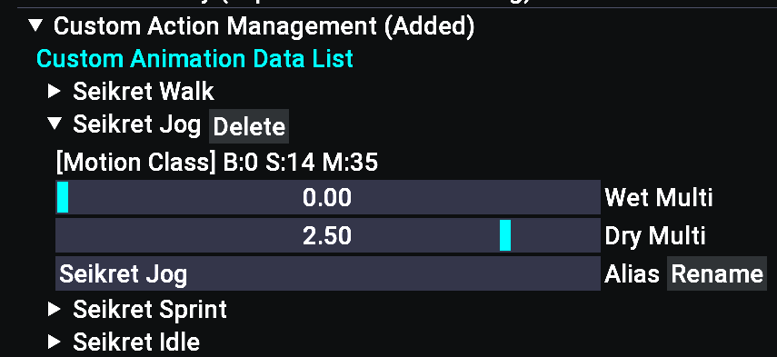

# Dynamic Sweat System
Fork of [Dynamic Sweat System](https://www.nexusmods.com/monsterhunterwilds/mods/3883) by ksumm, expanding on `Custom Action`.

Changes in this version:
- Expand the functionality of `Custom Action`:
- - Saved Custom Actions can be given a name/alias
- - Saved Custom Actions `Wet Multi` can be set: range 0.00 to 3.00
- - Saved Custom Actions `Dry Multi` can be set: range 0.00 to 3.00

- The `Wet Multi` affects overall sweat accumulation rate; `Dry Multi` affects overall sweat decrease rate.
- - For example, you can set riding a seikret `Wet Multi` to 0 and `Dry Multi` to 3.0 to "cool off" and reduce sweat.
- Custom Actions that are packed in with the mod are handled internally instead of being in the `SweatSystem.json` file (I have no clue what these motions are).
- Custom Actions values in the `SweatSystem.json` file are labeled to be more readable.

# Installation
Put [this `SweatSystem.lua` file](https://github.com/Kilvoctu/mhwilds-sweat/blob/main/SweatSystem/reframework/autorun/SweatSystem.lua) into your game's reframework/autorun folder, replacing the official one.